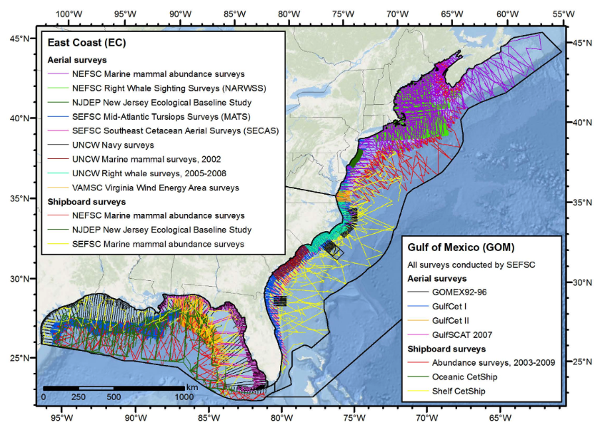

## Introduction

This vignette focuses on the use of the `dsmextra` R package to quantify and visualise model extrapolation in environmental space, with particular relevance to density surface model (DSMs) as implemented in package [`dsm`](https://cran.r-project.org/web/packages/dsm/index.html) [@Miller2015dsm]. The underlying theory behind extrapolation detection is covered at length in @Mesgaran2014 and @King2007. Illustrative case studies rely on a combined dataset of shipborne and aerial line transect surveys for cetaceans conducted in the Northwestern Atlantic and the Gulf of Mexico, and fully described in @Roberts2016 and @Mannocci2017 (**Figure 1**). A basic level of familiarity with density surface modelling is assumed - for technical details, see @Miller2013.

Note that this vignette accompanies a technical report on extrapolation in cetacean density surface models. See @Bouchet2019 for more information.

```{r surveys, echo=FALSE, out.width = '85%', fig.align="center", fig.cap="<b>Fig. 1:</b> Visual line transect surveys undertaken in the North Atlantic and Gulf of Mexico. <u>Source</u>: @Roberts2016."}

```

## Installation

Install from CRAN:

```{r eval=FALSE, message=FALSE, warning=FALSE, include=TRUE}
install.packages("dsmextra")
```

```{r eval=FALSE, message=FALSE, warning=FALSE, include=TRUE}
library(dsmextra)
```

Install latest development version from GitHub (requires devtools package):

```{r echo=FALSE, message=FALSE, warning=FALSE, include=FALSE}
# devtools::install_github("densitymodelling/dsmextra", dependencies = TRUE, build_vignettes = FALSE)
```

```{r echo=TRUE, message=FALSE, warning=FALSE}

#'--------------------------------------------------------------------
# Set tibble options
#'--------------------------------------------------------------------

options(tibble.width = Inf) # All tibble columns shown
options(pillar.neg = FALSE) # No colouring negative numbers
options(pillar.subtle = TRUE)
options(pillar.sigfig = 4)

#'--------------------------------------------------------------------
# Set knitr options
#'--------------------------------------------------------------------

knitr::opts_chunk$set(echo = TRUE)
```

`dsmextra` builds upon the functions available in the [`ecospat`](https://cran.r-project.org/web/packages/ecospat/index.html) [@Broennimann2016] and [`WhatIf`](https://cran.r-project.org/web/packages/WhatIf/index.html) [@Gandrud2017] packages to provide user-friendly tools relevant to the analysis of distance sampling data. Specifically, `dsmextra` enables an *a priori* evaluation of environmental extrapolation, when using a DSM model built in a **reference** system to make predictions in a separate **target** system (e.g. a different geographical area and/or a past/future time period) [@Sequeira2018]. 

## Example 1: Sperm whales

```{r physeter, echo=FALSE, out.width = '100%'}

```

### Overview

This section covers all the steps required to undertake an extrapolation assessment, and explains how to:

+ Quantify extrapolation using `compute_extrapolation`.
+ Obtain a summary of extrapolation using `summarise_extrapolation`.  
+ Identify covariates responsible for extrapolation using `compare_covariates`.
+ Calculate a neighbourhood metric of extrapolation using `compute_nearby`.
+ Generate maps of extrapolation using `map_extrapolation`.
+ Run a full assessment using `extrapolation_analysis`.

### Data

The data for this example come from [two shipboard surveys](http://seamap.env.duke.edu/dataset/396) run by the National Oceanic and Atmospheric Administration (NOAA)'s Northeast and Southeast Fisheries Science Centers. They represent a subset of the survey effort shown in @Roberts2016 and @Mannocci2017, and are included in `dsmextra` in as a `list` object containing both segment-level and prediction data.

```{r echo=TRUE, message=FALSE, warning=FALSE}

#'---------------------------------------------
# Load and extract the sperm whale data
#'---------------------------------------------

data("spermwhales")

segs <- spermwhales$segs
predgrid <- spermwhales$predgrid

```

We are primarily interested in the following two `data.frames`:

`segs` holds the segment data, i.e. the line transects that have been 'chopped' into segments. These correspond to as the **reference** (or *calibration*) data/system/conditions [@Sequeira2018].

```{r echo=TRUE, message=FALSE, warning=FALSE}
knitr::kable(head(segs), format = "pandoc")
```

`predgrid` holds the coordinates and covariate values for grid cells over which density surface model predictions are ultimately sought (although model fitting is outside the scope of this vignette). These are referred to as the **target** data/system/conditions [@Sequeira2018].

```{r echo=TRUE, message=FALSE, warning=FALSE}
knitr::kable(head(predgrid), format = "pandoc")
```

Further, we also have a record of individual sperm whale sightings, as well as a spatial representation of survey track lines (**Figure 2**).

```{r echo=TRUE, message=FALSE, warning=FALSE}
knitr::kable(head(obs), format = "pandoc")
```

A quick map in base R is useful to get a feel for the distribution of sightings throughout the area.

```{r echo=TRUE, message=FALSE, warning=FALSE, fig.cap="<b>Fig. 2:</b> Distribution of sperm whale (<em>Physeter macrocephalus</em>) sightings (in blue) within the study area (orange outline) off the US East coast. Surveyed transects are shown as solid lines."}

#'---------------------------------------------
# Create an outline of the study area boundaries
#'---------------------------------------------

study_area <- predgrid[, c("x", "y")]
study_area$value <- 1
study_area <- raster::rasterFromXYZ(study_area, crs = sp::CRS("+proj=aea +lat_1=38 +lat_2=30 +lat_0=34 +lon_0=-73 +x_0=0 +y_0=0 +datum=WGS84 +units=m +no_defs +ellps=WGS84 +towgs84=0,0,0"))
study_area <- raster::rasterToPolygons(study_area, dissolve = TRUE)
study_area <- sp::spTransform(study_area, CRSobj = sp::proj4string(transects))
study_area <- smoothr::smooth(study_area, method = "ksmooth", smoothness = 5)

#'---------------------------------------------
# Produce a simple plot
#'---------------------------------------------

plot(study_area, border = "darkorange") # Region boundary
plot(transects, add = TRUE) # Survey tracks
maps::map("world", fill = TRUE, col = "grey", 
          xlim = range(obs$coords.x1), 
          ylim = range(obs$coords.x2), add = TRUE)
pts <- obs # Sightings
coordinates(pts) <- ~ coords.x1 + coords.x2
axis(1)
axis(2)
box()
points(pts, pch = 21, col = "#2082C4")
```

### Analysis

In this particular example, we already know what projected coordinate system is in use (ie. Albers Equal Area, `+proj=aea`). The explanatory covariates of interest are: seabed depth (`Depth`), sea surface temperature (`SST`), primary productivity (`NPP`), distance to the nearest canyons and seamounts (`DistToCAS`), and eddy kinetic energy (`EKE`) -- see @Roberts2016 for details.

```{r echo=TRUE, message=FALSE, warning=FALSE}
#'---------------------------------------------
# Define projected coordinate system
#'---------------------------------------------

aftt_crs <- sp::CRS("+proj=aea +lat_1=38 +lat_2=30 +lat_0=34 +lon_0=-73 +x_0=0 +y_0=0 +datum=WGS84 +units=m +no_defs +ellps=WGS84 +towgs84=0,0,0")

#'---------------------------------------------
# Define environmental covariates of interest
#'---------------------------------------------

covariates.spermw <- c("Depth", "SST", "NPP", "DistToCAS", "EKE")
```

#### Quantifying extrapolation

To assess extrapolation in environmental space, we can run the extrapolation detection (ExDet) tool proposed by @Mesgaran2014 using `compute_extrapolation`.

Note that this tool was originally implemented in the [`ecospat`](https://cran.r-project.org/src/contrib/Archive/ecospat/) package, although with more limited capabilities.

The function takes the following arguments:

+ `segments`: reference data
+ `covariate.names`: names of covariates of interest
+ `prediction.grid`: target data
+ `coordinate.system`: projected coordinate system relevant to study location
+ `print.summary`: if `TRUE`, prints a summary of the results in the R console
+ `print.precision`: number of significant figures printed in the summary
+ `save.summary`: if `TRUE`, saves summary to the function's output object

Here, we store the results in an object called `spermw.extrapolation`. 
Values are expressed as both the number (`n`) of grid cells subject to extrapolation, and the proportion (`%`) of the target system that this represents.

```{r echo=TRUE, message=FALSE, warning=FALSE}

spermw.extrapolation <- compute_extrapolation(segments = segs, 
                                   covariate.names = covariates.spermw, 
                                   prediction.grid = predgrid,
                                   coordinate.system = aftt_crs,
                                   print.summary = TRUE,
                                   save.summary = FALSE,
                                   print.precision = 2)
```

In this example, the vast majority of prediction grid cells (n = 5,175 -- ie. 97.92%) are characterised by environmental conditions (defined along the axes of the covariates specified above) similar to those captured in the original sample (`segs`).

A quick check reveals that those results align with our expectations from the data in `predgrid`. 

```{r echo=TRUE, message=FALSE, warning=FALSE}

# Number of cells subject to univariate extrapolation (see below for definition)

predgrid %>% 
  dplyr::filter(!dplyr::between(Depth, min(segs$Depth), max(segs$Depth)) | 
                  !dplyr::between(SST, min(segs$SST), max(segs$SST)) |
                  !dplyr::between(NPP, min(segs$NPP), max(segs$NPP)) |
                  !dplyr::between(DistToCAS, min(segs$DistToCAS), max(segs$DistToCAS)) |
                  !dplyr::between(EKE, min(segs$EKE), max(segs$EKE))) %>% 
  nrow()

```

In practice,  `compute_extrapolation` returns a list containing both `data.frames` (extrapolation values) and `rasters` (spatial representation of these values), with the following structure:

```{r echo=TRUE, message=FALSE, warning=FALSE}
tibble::glimpse(spermw.extrapolation)
```

Three types of extrapolation can be identified (**Figure 3**):

+ **Univariate** extrapolation occurs when `ExDet` values < 0. It is also known as *mathematical*, *strict*, or *Type 1* extrapolation, and represents conditions outside the range of individual covariates in the reference sample.
+ **Combinatorial** extrapolation occurs when `ExDet` values > 1. It is also known as *multivariate* or *Type 2* extrapolation, and describes novel combinations of values encountered within the univariate range of reference covariates. Such combinations are identified based on the Mahalanobis distance metric (D^2^), a well-known and scale-invariant measure of multivariate outliers [@Rousseeuw1990].
+ Lastly, values between 0 and 1 denote predictions made in **analogue** conditions. These correspond to what is commonly referred to as *interpolation*, although if found in a different region in space or past/future period in time, then the terms *geographical/temporal* extrapolation are sometimes also used.

```{r ExDet, echo=FALSE, out.width = '50%', fig.align="center", fig.cap="<b>Fig. 3:</b> Schematic representation of extrapolation in multivariate environmental space, based on two hypothetical covariates. Reference data points are represented as grey circles. Shaded areas correspond to different types of extrapolation outside the envelope of the reference data. Univariate extrapolation occurs beyond the range of individual covariates. Combinatorial extrapolation occurs within this range, but outside the reference hyperspace/hypervolume. <u>Source</u>: @Bouchet2019, adapted from @Mesgaran2014."}
knitr::include_graphics("Extrapolation_Figure2.png")
```

`compute_extrapolation` also determines which covariate makes the largest contribution to extrapolation for any given grid cell, ie. the **most influential covariate** (`mic`). In univariate extrapolation, this is the covariate that leads to the highest negative univariate distance from the initial covariate range. In combinatorial extrapolation, this corresponds to the covariate whose omission (while retaining all others) makes the largest reduction in the Mahalanobis distance to the centroid of the reference data. See @Mesgaran2014 for formulae and technical explanations.

`ExDet` values can be retrieved from the returned list, as below:

```{r echo=TRUE, message=FALSE, warning=FALSE}
# Example from combinatorial extrapolation

head(spermw.extrapolation$data$combinatorial)
```

#### Summarising extrapolation

The summary table generated by `compute_extrapolation` is the result of an internal call to the function `summarise_extrapolation`. This function can also be run separately on the output of `compute_extrapolation`, if needed. 

The function takes the following arguments:

+ `extrapolation.object`: output from compute_extrapolation
+ `covariate.names`: names of covariates of interest
+ `extrapolation`: if `TRUE`, returns a summary of univariate/combinatorial extrapolation
+ `mic`: if `TRUE`, returns a summary of the most influential covariates
+ `print.precision`: number of significant figures printed in the summary

Note that values of the summary statistics can be saved to an object in list form (here the `summary.values` object).

```{r echo=TRUE, message=FALSE, warning=FALSE}
summary.values <- summarise_extrapolation(extrapolation.object = spermw.extrapolation,
                        covariate.names = covariates.spermw,
                        extrapolation = TRUE,
                        mic = TRUE,
                        print.precision = 2)
summary.values
```


#### Comparing covariates

The extent and magnitude of extrapolation naturally varies with the type and number of covariates considered. It may be useful, therefore, to test different combinations of covariates to inform their selection *a priori*, ie. before model fitting, thereby supporting model parsimony.

The `compare_covariates` function is available for this purpose. It is designed to assess extrapolation iteratively for all combinations of `n.covariates`, and return an overview of those that minimise/maximise extrapolation (as measured by the number of grid cells subject to extrapolation in the prediction area).

`n.covariates` can be supplied as any vector of integers from 1 to `p`, where `p` is the total number of covariates available. Its default value of `NULL` is equivalent to `1:p`, meaning that all possible combinations are tested, unless otherwise specified.

Additional arguments include:

+ `extrapolation.type`: one of `'univariate'`, `'combinatorial'` or `'both'`
+ `segments`: reference data
+ `covariate.names`: names of covariates of interest
+ `prediction.grid`: target data
+ `coordinate.system`: projected coordinate system relevant to study location
+ `create.plots`: if `TRUE`, generates boxplots of results
+ `display.percent`: if `TRUE`, the y-axis of the boxplots is expressed as a percentage of the total number of grid cells in `prediction.grid`

Below is an example for both types of extrapolation, and the full set of five covariates.

```{r echo=TRUE, message=TRUE, warning=FALSE}
compare_covariates(extrapolation.type = "both",
                   covariate.names = covariates.spermw,
                   n.covariates = NULL,
                   segments = segs, 
                   prediction.grid = predgrid,
                   coordinate.system = aftt_crs,
                   create.plots = TRUE,
                   display.percent = TRUE)
```

The top graph summarises the extent of univariate (yellow) and combinatorial (blue) extrapolation for all combinations of $1, 2, ..., n$ covariates. The total number of combinations is given above each boxplot as $N_c$. As expected, univariate extrapolation increases with the number of covariates considered.

The bottom graph displays the same results, summarised by covariate of interest. This may help identify any covariates that consistently lead to extrapolation, and should be avoided. Here, none of the covariates stand out as driving extrapolation more than any others, although combinatorial extrapolation is marginally more prevalent with `NPP` and `SST`.

#### Finding nearby data

While extrapolation is often seen as a binary concept (ie. it either does or does not take place), it is reasonable to expect that predictions made at target points situated just outside the sampled environmental space may be more reliable than those made at points far outside it. The ExDet tool available through `compute_extrapolation` inherently quantifies this notion of 'distance' from the envelope (solid line) of the reference data (grey circles) (**Figure 4A**). 

However, the multivariate distribution of reference data points is often far from homegeneous. It is possible, therefore, for target points representing analogue conditions to fall within sparsely sampled regions of the reference space; or conversely, for two target points reflecting an equal degree of extrapolation to have very different amounts of reference data within their vicinity.

An example of this is shown in **Figure 4B**, where three target points $x_1$, $x_2$ and $x_3$ are located equally close to the envelope of the reference data. In essence, these reflect identical degrees of extrapolation, as defined under the ExDet framework. However, given the shape of the data cloud in multivariate space, it is apparent that predictions made at target point $x_1$ will be much better 'informed' than those made at $x_2$ or $x_3$, as a bigger cluster of reference points lies nearby (green circle around $x_1$).

```{r neighbour, echo=FALSE, out.width = '85%', fig.align="center", fig.cap="<b>Fig. 4:</b> Conceptual representation of two key extrapolation metrics. (A) Distance from the sampled environmental space. A target point far from the envelope of the reference data (eg. falling in the yellow area) is arguably 'more of an extrapolation' than one close to it (eg. falling in the purple area).  (B) Neighbourhood (syn. percentage of data nearby). Due to the shape of the reference data cloud, the amount of sample information available to 'inform' predictions made at target points can vary considerably. <u>Source</u>: @Bouchet2019."}
knitr::include_graphics("Extrapolation_Figure3.png")
```

The notion of **neighbourhood** (or **percentage/proportion of data nearby**, hereafter **%N**) captures this idea, and provides an additional measure of the reliability of extrapolations in multivariate environmental space [@Mannocci2018; @Virgili2017]. In practice, `%N` for any target point can be defined as the proportion of reference data within a radius of one geometric mean Gower’s distance (G^2^, calculated between all pairs of reference points) [@King2007]. The Gower’s distance between two points $i$ and $j$ defined along the axes of $K$ covariates is calculated as the average absolute distance between the values of these two points in each dimension, divided by the range of the data, such that:

$$G_{ij}^2=\frac{1}{K}\sum_{k=1}^{K}\frac{\left|x_{ik}-x_{jk}\right|}{\textrm{max}(X_k)-\textrm{min}(X_k)}$$


The `compute_nearby` function is adapted from the code given in @Mannocci2018 and allows the calculation of Gower’s distances (G^2^) as a basis for defining the neighbourhood.

The `neighbourhood` argument to this function corresponds to the radius within which neighbouhood calculations will occur. It has a default value of `1`, as per @Mannocci2018 and @Virgili2017. Increasing its value (eg. to say, `2`) would mean doubling the size of the green circles in **Figure 4B**, and would lead to larger percentages of data nearby per target point.

**Important:** The sperm whale dataset used here is sufficiently small that `compute_nearby` should run in a matter of seconds on most machines. However, applying the function to larger datasets may burn out memory allocation and lead to an R session failure. Additional arguments can be passed to `compute_nearby` to accommodate such 'big' data. Their use is unnecessary here, but is illustrated in the subsequent case study on beaked whales (see below). 

```{r echo=TRUE, message=TRUE, warning=FALSE}
#'---------------------------------------------
# Calculate Gower's distances and %N
#'---------------------------------------------

spermw.nearby <- compute_nearby(segments = segs, 
                   prediction.grid = predgrid, 
                   coordinate.system = aftt_crs,
                   covariate.names = covariates.spermw,
                   neighbourhood = 1)
```

#### Visualising extrapolation

Lastly, we can use the `map_extrapolation` function to create a series of interactive html maps of extrapolation in the prediction area.

Arguments to this function are identical to those of `compute_extrapolation`, with the exception of:

+ `map.type`: output to be shown on the map. One of `'extrapolation'` for a map of extrapolation values, `'mic'` for a map of the most influential covariates, or `'nearby'` for a neighbourhood map (proportion of reference data near each target grid cell, a.k.a %N).
+ `extrapolation.values`: output from `compute_extrapolation` (only valid for `map.type = 'extrapolation'` and `map.type = 'mic'`)
+ `gower.values`: output from `compute_nearby` (only valid for `map.type = 'nearby'`)

`sightings` and `tracks` are optional arguments, and only plotted if specified. If either is provided as a matrix, then coordinates must be labelled `x` and `y`, lest a warning be returned. Tracks can also be given as a `SpatialLinesDataFrame` object.

```{r echo=TRUE, message=FALSE, warning=FALSE}

#'---------------------------------------------
# Rename coordinates and convert to SpatialPointsdf
#'---------------------------------------------

obs.sp <- obs %>% 
  dplyr::rename(., x = coords.x1, y = coords.x2) %>% 
  sp::SpatialPointsDataFrame(coords = cbind(.$x, .$y), data = ., proj4string = sp::CRS("+proj=longlat +datum=WGS84 +no_defs +ellps=WGS84 +towgs84=0,0,0")) %>% 
  sp::spTransform(., CRSobj = aftt_crs)

```

The resulting maps can be panned, zoomed, and all layers toggled on and off independently. However, note that maps rely on the `leaflet` package [@Cheng2018], and thus require an internet connection - they will not work offline. Facilities to save map tiles locally for offline viewing are currently not implemented but may be rolled into a future version of the code. Finally, note that `prediction.grid` is only used here to set the map extent when plotting.

Here's a map of extrapolation (`ExDet`) values:

```{r echo=TRUE, message=FALSE, warning=FALSE, fig.cap=" "}
map_extrapolation(map.type = "extrapolation",
                  extrapolation.values = spermw.extrapolation,
                  covariate.names = covariates.spermw,
                  prediction.grid = predgrid, 
                  coordinate.system = aftt_crs,
                  sightings = NULL, 
                  tracks = transects)
```

Most influential covariates (MIC):

```{r echo=TRUE, message=FALSE, warning=FALSE, fig.cap=" "}

map_extrapolation(map.type = "mic",
                  extrapolation.values = spermw.extrapolation,
                  covariate.names = covariates.spermw,
                  prediction.grid = predgrid, 
                  coordinate.system = aftt_crs,
                  sightings = obs.sp, 
                  tracks = transects)
```

Proportion of data nearby (%N):

```{r echo=TRUE, message=FALSE, warning=FALSE, fig.cap=" "}
map_extrapolation(map.type = "nearby",
                  gower.values = spermw.nearby,
                  covariate.names = covariates.spermw,
                  prediction.grid = predgrid, 
                  coordinate.system = aftt_crs,
                  sightings = obs.sp, 
                  tracks = transects)
```

#### Full analysis
  
For simplicity, all the above analyses can be performed in a single step by calling the wrapper function `analyse_extrapolation`. Most arguments are derived from the individual functions presented above, and should thus be self-explanatory. Note, however, that specific parts of the analysis can be run/bypassed using the following arguments:

+ `summarise.extrapolation`: if `TRUE`, run `summarise_extrapolation`
+ `compare.covariates` = if `TRUE`, run `compare_covariates`
+ `compute.nearby` = if `TRUE`, run `compute_nearby`
+ `generate.maps` = if `TRUE`, run `map_extrapolation`

```{r echo=TRUE, message=FALSE, warning=FALSE, eval=FALSE}
#'---------------------------------------------
# One function to rule them all, one funtion to find them, 
# One function to bring them all, and in the darkness bind them.
#'---------------------------------------------

spermw.analysis <- analyse_extrapolation(segments = segs,
                                          covariate.names = covariates.spermw,
                                          prediction.grid = predgrid,
                                          coordinate.system = aftt_crs,
                                          summarise.extrapolation = TRUE,
                                          summary.mic = TRUE,
                                          summary.print.precision = 2,
                                          compare.covariates = TRUE,
                                          compare.extrapolation.type = "both",
                                          compare.n.covariates = NULL,
                                          compare.create.plots = TRUE,
                                          compare.display.percent = TRUE,
                                          compute.nearby = TRUE,
                                          nearby.neighbourhood = 1,
                                          generate.maps = TRUE,
                                          sightings = obs.sp,
                                          tracks = transects)
```

```{r eval=TRUE, message=FALSE, warning=FALSE, include=FALSE, echo=FALSE}
#'---------------------------------------------
# One function to rule them all, one funtion to find them, 
# One function to bring them all, and in the darkness bind them.
#'---------------------------------------------

spermw.analysis <- analyse_extrapolation(segments = segs,
                                          covariate.names = covariates.spermw,
                                          prediction.grid = predgrid,
                                          coordinate.system = aftt_crs,
                                          summarise.extrapolation = TRUE,
                                          summary.mic = TRUE,
                                          summary.print.precision = 2,
                                          compare.covariates = TRUE,
                                          compare.extrapolation.type = "both",
                                          compare.n.covariates = NULL,
                                          compare.create.plots = TRUE,
                                          compare.display.percent = TRUE,
                                          compute.nearby = TRUE,
                                          nearby.neighbourhood = 1,
                                          nearby.max.size = 1e7,
                                          nearby.no.partitions = 10,
                                          generate.maps = TRUE,
                                          sightings = obs.sp,
                                          tracks = transects)
```

Results are packaged in a `list` object with three levels, ie. `extrapolation`, `nearby`, and `maps`, representing the outputs of each step in the analysis.

```{r echo=TRUE, message=FALSE, warning=FALSE}
purrr::map(spermw.analysis, ~class(.))
```

